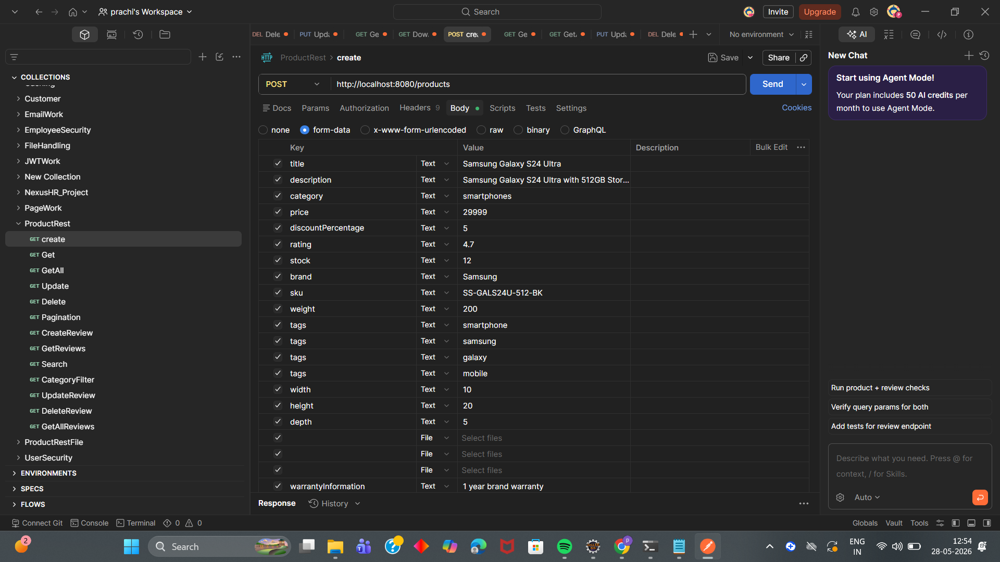
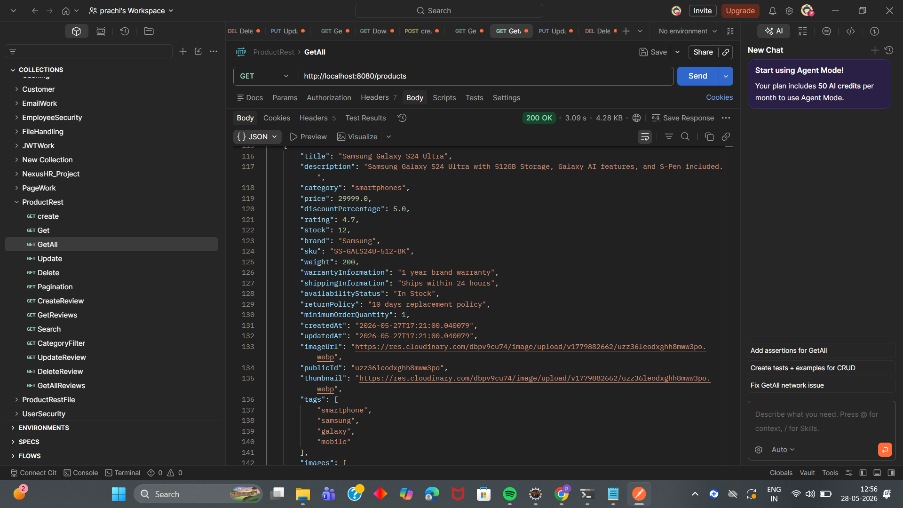
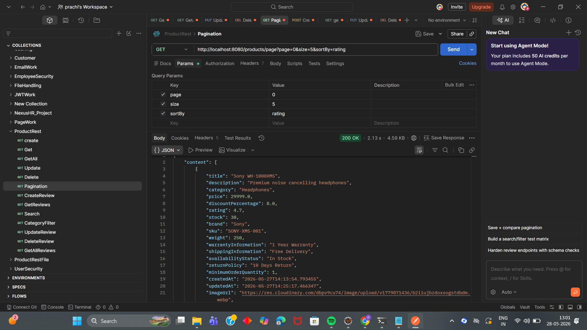
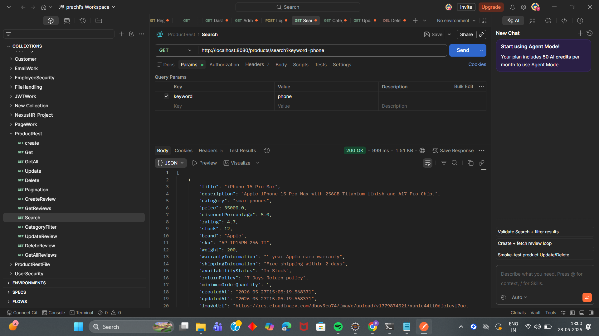
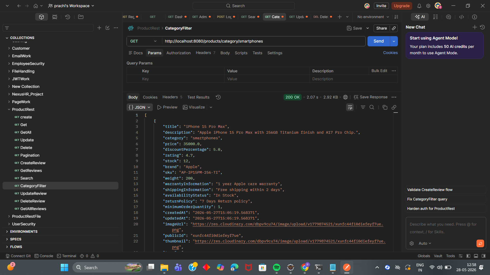
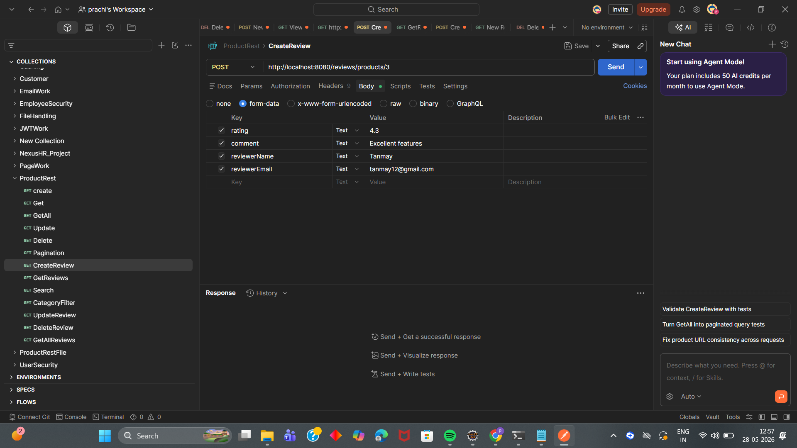
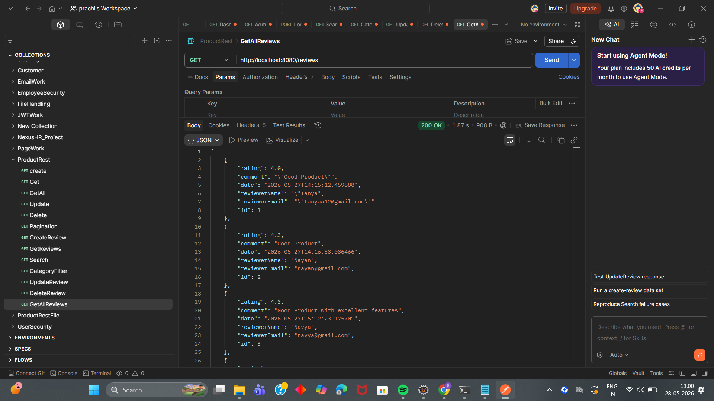

# 🛍️ ProductRest API

A Spring Boot Product REST API with CRUD, reviews, pagination, search, sorting, MySQL, and Cloudinary image upload.

This project provides:

- Product Management (CRUD)
- Product Reviews (CRUD)
- Product Search
- Category Filtering
- Pagination & Sorting
- Multi-image Upload using Cloudinary
- Product Dimensions Support
- Review System for Products

---

## 🚀 Live Demo 

[https://product-rest-apis.onrender.com](https://product-rest-apis.onrender.com)

You can test the APIs directly using the endpoints.

---

# 🚀 Features

## Product Features
✔ Create Product  
✔ Update Product  
✔ Delete Product  
✔ Get All Products  
✔ Get Product By ID  
✔ Search Product by Title  
✔ Filter Products by Category  
✔ Pagination & Sorting  
✔ Multiple Image Upload (Cloudinary)  
✔ Product Dimensions Support  

## Review Features
✔ Create Review  
✔ Update Review  
✔ Delete Review  
✔ Get All Reviews  
✔ Get Review By ID  
✔ Get Reviews By Product  

---

# 🛠 Tech Stack

- Java 17
- Spring Boot
- Spring Data JPA
- Hibernate
- MySQL
- Maven
- Cloudinary (Image Upload)
- REST API

---

# 📂 Project Structure

```txt
src/main/java/com/work/ProductRest
│
├── controller
│   ├── ProductsController.java
│   └── ReviewController.java
│
├── service
│   ├── ProductsService.java
│   └── ReviewService.java
│
├── repository
│   ├── ProductsRepository.java
│   └── ReviewRepository.java
│
├── model
│   ├── Products.java
│   ├── Review.java
│   └── Dimensions.java
│
├── config
│   └── CloudinaryConfiguration.java
│
└── ProductRestApplication.java
```

---

# 🧩 Entity Relationship

```txt
Products
 ├── Dimensions (Embedded)
 ├── Reviews (OneToMany)
 ├── Tags (List<String>)
 ├── Images (List<String>)
```

### Product → Review Relationship

```txt
One Product -> Many Reviews
```

---

# 🗃 Database Schema

## Products

| Field | Type |
|-------|------|
| id | Long |
| title | String |
| description | String |
| category | String |
| price | double |
| discountPercentage | double |
| rating | double |
| stock | int |
| brand | String |
| sku | String |
| weight | int |
| warrantyInformation | String |
| shippingInformation | String |
| availabilityStatus | String |
| returnPolicy | String |
| minimumOrderQuantity | int |
| createdAt | LocalDateTime |
| updatedAt | LocalDateTime |
| imageUrl | String |
| publicId | String |
| thumbnail | String |
| tags | List<String> |
| images | List<String> |
| dimensions | Embedded |
| reviews | OneToMany |

---

## Review

| Field | Type |
|-------|------|
| id | Long |
| rating | double |
| comment | String |
| date | LocalDateTime |
| reviewerName | String |
| reviewerEmail | String |

---

## . Configure Database

Update `application.properties`

```properties
spring.datasource.url=jdbc:mysql://localhost:3306/productdb
spring.datasource.username=root
spring.datasource.password=your_password

spring.jpa.hibernate.ddl-auto=update
spring.jpa.show-sql=true
spring.jpa.properties.hibernate.format_sql=true
```

---

## . Configure Cloudinary

Add your Cloudinary credentials.

```properties
cloudinary.cloud_name=YOUR_CLOUD_NAME
cloudinary.api_key=YOUR_API_KEY
cloudinary.api_secret=YOUR_API_SECRET
```

# 🌐 Base URL

```http
http://localhost:8082
```

---

# 📌 API Endpoints

# Product APIs

## 1. Create Product

### Endpoint

```http
POST /products
```

### Form Data

```txt
title=Men T-Shirt
description=Cotton tshirt
category=mens-wear
price=999
discountPercentage=10
rating=4.5
stock=20
brand=Puma
sku=SKU123
weight=400
warrantyInformation=1 month
shippingInformation=Ships in 3 days
returnPolicy=7 day return
minimumOrderQuantity=1

tags=mens
tags=tshirt
tags=fashion

width=10
height=20
depth=5

files=image1
files=image2
files=image3
```

---

## 2. Get All Products

```http
GET /products
```

---

## 3. Get Product By ID

```http
GET /products/{id}
```

Example:

```http
GET /products/1
```

---

## 4. Update Product

```http
PUT /products/{id}
```

Example:

```http
PUT /products/1
```

---

## 5. Delete Product

```http
DELETE /products/{id}
```

Example:

```http
DELETE /products/1
```

---

## 6. Search Product

Search by title.

```http
GET /products/search?keyword=shirt
```

---

## 7. Filter By Category

```http
GET /products/category/mens-wear
```

---

## 8. Pagination & Sorting

```http
GET /products/page?page=0&size=5&sortBy=price
```

Example:

```http
GET /products/page?page=0&size=3&sortBy=title
```

---

# ⭐ Review APIs

## 1. Create Review

```http
POST /reviews/products/{productId}
```

Example:

```http
POST /reviews/products/1
```

### Params

```txt
rating=5
comment=Amazing product
reviewerName=Rahul
reviewerEmail=rahul@gmail.com
```

---

## 2. Get All Reviews

```http
GET /reviews
```

---

## 3. Get Review By ID

```http
GET /reviews/{id}
```

---

## 4. Get Reviews By Product

```http
GET /reviews/products/{productId}
```

Example:

```http
GET /reviews/products/1
```

---

## 5. Update Review

```http
PUT /reviews/{id}
```

Example:

```http
PUT /reviews/1
```

---

## 6. Delete Review

```http
DELETE /reviews/{id}
```

---

# 🧪 API Testing

You can test APIs using:

- Postman
- Thunder Client
- Swagger (if added)

---

# 📷 Screenshots

## Create Product API



## Get All Products API



## Pagination API



## Search Product API



## Filter Product Category API



## Create Review API



## Get Reviews API



---

# 🔥 Future Improvements

- JWT Authentication
- Swagger Documentation
- Wishlist API
- Cart API
- Order Management
- Role Based Authorization
- Better Product Filtering
- DTO Layer
- Exception Handling

---

# 👨‍💻 Author

**Prachi Prajapati**
